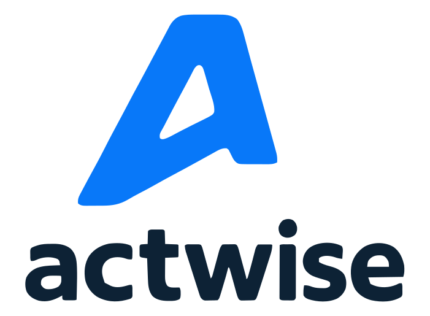

# Actwise Ideation Plugin

<p align="center">
  
</p>

Evaluate, improve, and benchmark startup and product ideas from supported AI clients.

Actwise Ideation applies a venture-capital-informed lens across problem urgency, customer clarity, insight, distribution, market, timing, and moat. The hosted MCP service provides the current evaluation contract, tools, resources, and browser-based OAuth flow.

## Install

### Agent Plugins CLI

Install the portable Agent Plugins package into a supported coding agent:

```bash
npx plugins add actwiseai/actwise-ideation-plugin
```

### Grok Build

```bash
grok plugin install actwiseai/actwise-ideation-plugin --trust
```

Open `/mcps`, select `actwise-ideation`, and complete browser authentication.

### Claude Code

```bash
claude plugin marketplace add actwiseai/actwise-ideation-plugin
claude plugin install actwise-ideation@actwise
```

### Codex

```bash
codex plugin marketplace add actwiseai/actwise-ideation-plugin
codex plugin add actwise-ideation@actwise
```

### Cursor

```bash
npx --yes plugins@1.3.4 add actwiseai/actwise-ideation-plugin --target cursor --scope user --yes
```

### Other clients

See the setup guides for [ChatGPT](docs/chatgpt/README.md), [Cursor](docs/cursor/README.md), and [Devin](docs/devin/README.md).

## Start an evaluation

After authentication, start a new conversation and paste:

```text
Use Actwise Ideation to evaluate this idea.

Follow all Actwise-provided instructions throughout. Present the returned rendered presentation Markdown unmodified. If evaluation cannot be completed, report the failure; never reconstruct or fabricate a result.

Then preview, improve, and re-measure the idea, or run an official evaluation when it is ready for a benchmarked snapshot.

Describe your idea and discuss it.

```

The installed skill lets supported agents recognize this workflow without requiring the full starter prompt.

## What this repository contains

- A portable Agent Plugins v1 manifest and hosted MCP configuration.
- Native manifests for Codex, ChatGPT, Claude Code, and Grok Build.
- One canonical `actwise-ideation` skill.
- Client-specific installation guides.
- Automated consistency and safety checks.

This repository contains distribution metadata and agent instructions only. It does not contain the Actwise evaluation service or scoring implementation.

## Endpoint and authentication

All self-installed packages connect to:

```text
https://actwise.ai/ideation/mcp/v1
```

The endpoint uses browser-based OAuth. Do not add access tokens, client secrets, API keys, or user credentials to this repository.

## Development

Requires Node.js 23.6.1 for repository validation. Installing the hosted plugin does not require a local Node.js runtime.

```bash
npm test
```

## Links

- [Actwise Ideation](https://actwise.ai/home/ideation)
- [Support](https://actwise.ai/home/support)
- [Privacy Policy](https://actwise.ai/home/privacy)
- [Terms of Service](https://actwise.ai/home/terms)

## License

MIT
